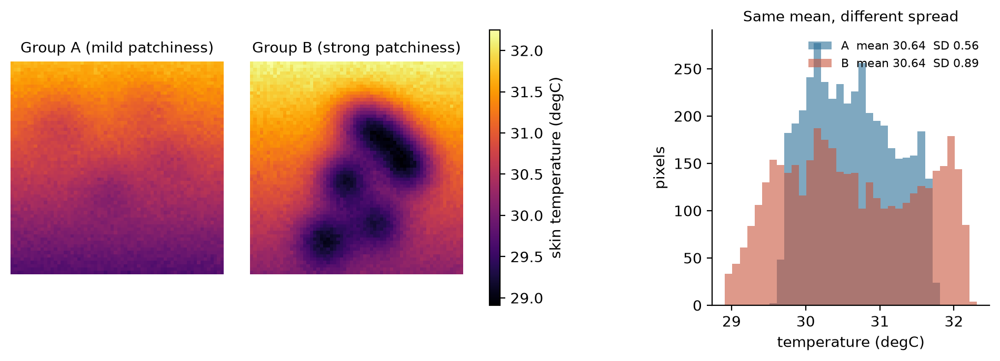
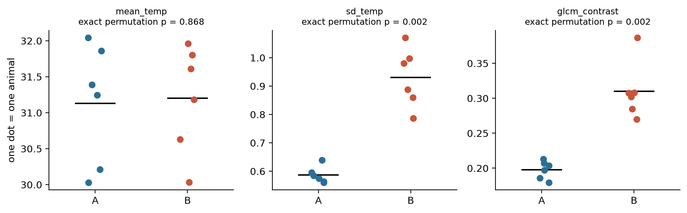
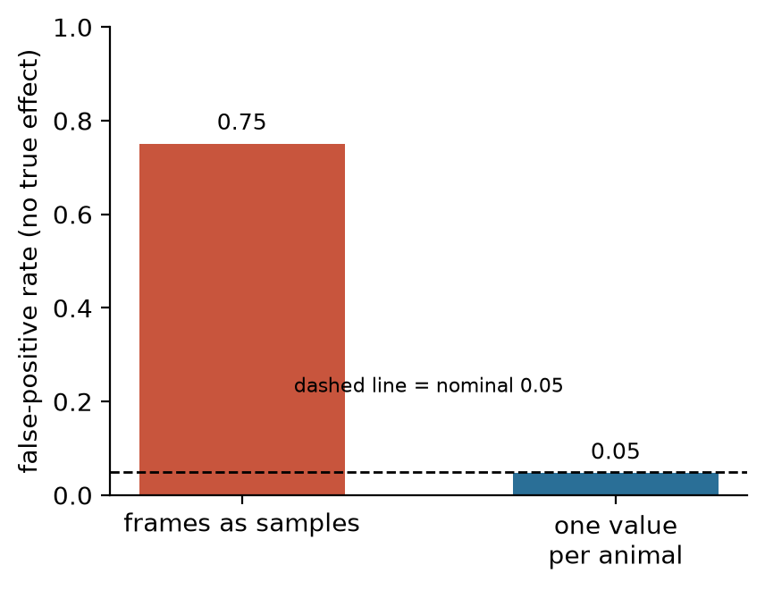

# Thermography heterogeneity demo (synthetic data)

A small, runnable exercise on one methodological question in infrared thermography of peripheral perfusion: **can the spatial heterogeneity of skin temperature (how uneven the temperature map is) separate two groups that have the same mean temperature, and how do you test that without counting the same animal many times?**

All data are synthetic and generated by the script. Nothing here is a clinical or experimental result. The assumptions behind the generator are listed in `thermo_demo.py` (top of file) and are my own modeling choices, not measurements.

Author: Joy dela Victoria, MD | Master in Medical Device Engineering, Polytech Lyon-UCBL1

## Why this question

A mean skin temperature, or a core-to-peripheral gradient, compresses a whole thermal image into one number. Two images can share that number and still differ in how patchy the temperature field is. Patchiness is what a perfusion problem can look like on the skin. The second issue is statistical: frames from the same animal are not independent samples, and between-animal variance in skin temperature is large. Treating every frame as a sample (pseudo-replication) inflates false positives.

## What the code does

| Step | Function | What it does |
|---|---|---|
| 1 | `make_dataset` | Builds 6 + 6 synthetic animals, 30 frames each (64 x 64 px, degC). Group B has strong cold patches, group A mild ones. Every frame of an animal is shifted to that animal's baseline, so group means are matched. Between-animal offset SD is 0.8 degC. |
| 2 | `frame_features` | Per frame: mean, SD, cold-area fraction (pixels more than 1.0 degC below the frame median), first-order entropy with a fixed 0.1 degC bin width, GLCM contrast (fixed 26 to 36 degC range, 32 gray levels). Per video: mean absolute frame-to-frame change. |
| 3 | `animal_level_test` | Averages frames to one value per animal, runs an exact permutation test on the difference of group means (all 924 relabelings), then Benjamini-Hochberg across the 6 features. A naive frame-level Welch t-test is reported next to it for contrast. |
| 4 | `simulate_false_positives` | 2,000 simulations with **no** true group effect, only between-animal variance. Counts how often each approach reports p < 0.05. |

Fixed bin width and a fixed intensity range are used so that feature values do not depend on each image's own min and max, which is the usual reproducibility problem with texture features.

## Run it

```bash
python -m venv .venv && source .venv/bin/activate     # Windows: .venv\Scripts\activate
pip install -r requirements.txt
python thermo_demo.py            # about 20 seconds; writes figures/ and results/
pytest -q                        # 5 tests
```

Tested on Python 3.11. Seeds are fixed (`--seed 42` for the dataset); the seed was not tuned.

## Results (default seed)



Equal mean (30.64 degC in the displayed frames), different spread (SD 0.56 vs 0.89 degC).



| Feature | Mean A | Mean B | Exact permutation p (animal level) | BH q |
|---|---|---|---|---|
| mean_temp | 31.13 | 31.20 | 0.868 | 0.868 |
| sd_temp | 0.586 | 0.930 | 0.0022 | 0.0026 |
| cold_fraction | 0.005 | 0.114 | 0.0022 | 0.0026 |
| entropy | 4.37 | 5.02 | 0.0022 | 0.0026 |
| glcm_contrast | 0.198 | 0.310 | 0.0022 | 0.0026 |
| temporal_change | 0.0565 | 0.0580 | 0.0022 | 0.0026 |

With 6 vs 6 animals the smallest attainable two-sided p-value is 2/924 = 0.0022, so several features sit exactly at that floor. Reading `temporal_change`: it separates the groups perfectly by rank, but the difference is 0.0015 degC per pixel per frame and is dominated by the pixel noise I simulated. A p-value at the floor does not mean a large or useful effect. Report effect sizes with it.



With no true effect, treating frames as samples gave a false-positive rate of **0.75**; one value per animal gave **0.0475** (nominal 0.05).

## Limits

- Synthetic data. The generator builds in the group difference, so step 3 recovers it by construction. The point of the exercise is the pipeline and the inference logic, not the finding.
- No real thermal files, no radiometric calibration, no segmentation or registration, no handling of ambient temperature or acclimatization. These are the first things real data would add.
- The frame-level t-test column in `group_comparison.csv` is kept as a negative example. Do not use it for inference.
- Descriptor definitions here (for example the cold-area threshold) are mine and illustrative. They are not a reimplementation of any published index.

## Next steps with real data

1. Read radiometric files and check calibration and emissivity settings.
2. Segment the region of interest and register frames over time.
3. Replace the animal-mean step with a mixed-effects model (random intercept per animal) so that within-animal frame information is used without pseudo-replication.
4. Test-retest reliability (ICC) of each descriptor before any group comparison.
5. Standardize and log the acquisition conditions: ambient temperature and its stability, acclimatization time, distance, angle.

## Files

```
thermo_demo.py        all four steps
tests/                5 unit tests
figures/              three figures produced by the script
results/              frame-level, animal-level, comparison and simulation CSVs
requirements.txt
```

License: MIT (add a `LICENSE` file when you publish).
